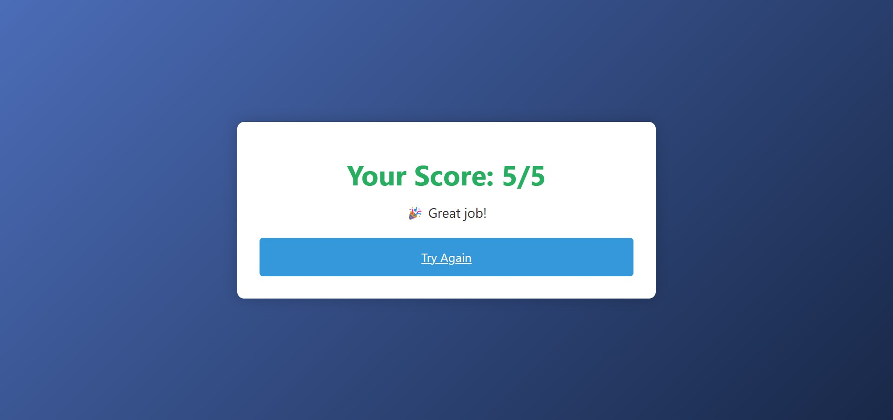

# Simple PHP Quiz Application 🧠

[](https://php.net/)
[](https://www.mysql.com/)

A clean and simple quiz application perfect for university projects or learning PHP fundamentals. Features 5 programming/general knowledge questions with instant scoring.




## Features ✨
- 5 curated questions with multiple choices
- Instant score calculation
- Responsive design
- Simple database integration
- Easy to modify questions
- Academic-friendly structure

## Requirements 📋
- PHP 7.4+
- MySQL/MariaDB
- Web server (Xampp/Nginx)
- Basic PHP/MySQL knowledge

## Installation 🛠️
1. Clone repository:
   ```bash
   git clone https://github.com/shatattya/php-quiz-app.git
   
## 2. Database Setup 🗃️

### Automated Setup (Recommended)

1.  **Start your local server** (XAMPP/MAMP/WAMP)
2.  **Open in browser:**
    [http://localhost/php-quiz-app/setup.php](http://localhost/php-quiz-app/setup.php)
3.  You should see: "Database initialized successfully!"

## Academic Use 🎓

**Perfect for:**
* PHP/MySQL coursework
* Web development basics
* Database integration demos
* Simple assessment systems

---

## FAQ ❓

* **Q: How to change questions?**
    * A: Edit `setup.php` and modify the INSERT statements
* **Q: Why am I seeing database errors?**
    * A: Ensure MySQL is running and check credentials in files
* **Q: Can I add more questions?**
    * A: Yes! Modify `setup.php` and follow existing pattern
 
## Course Applications

| Course             | Use Case                     |
|--------------------|------------------------------|
| Web Development    | Final project submission     |
| Database Systems   | Demonstrate CRUD operations  |
| Software Engineering| SDLC implementation example|
| HCI                | UI/UX analysis case study    |

---

## Project Extensions

* Add timer functionality ⏱️
* Implement user authentication 🔐
* Create admin dashboard 📊
* Add multiple quiz categories 📚
